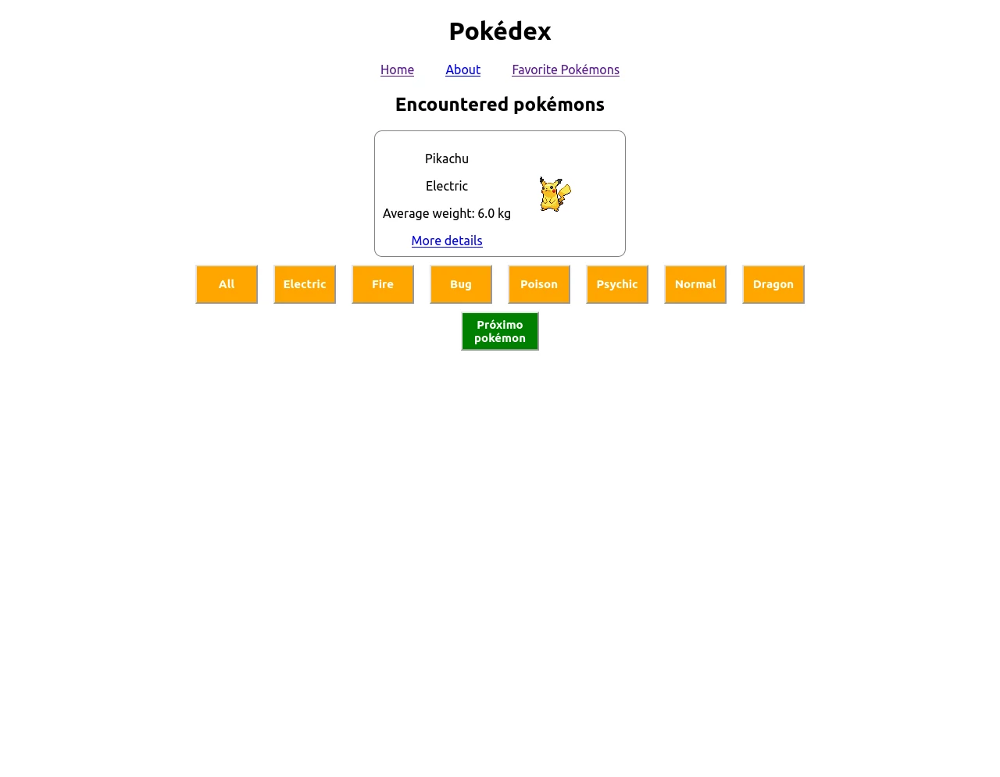
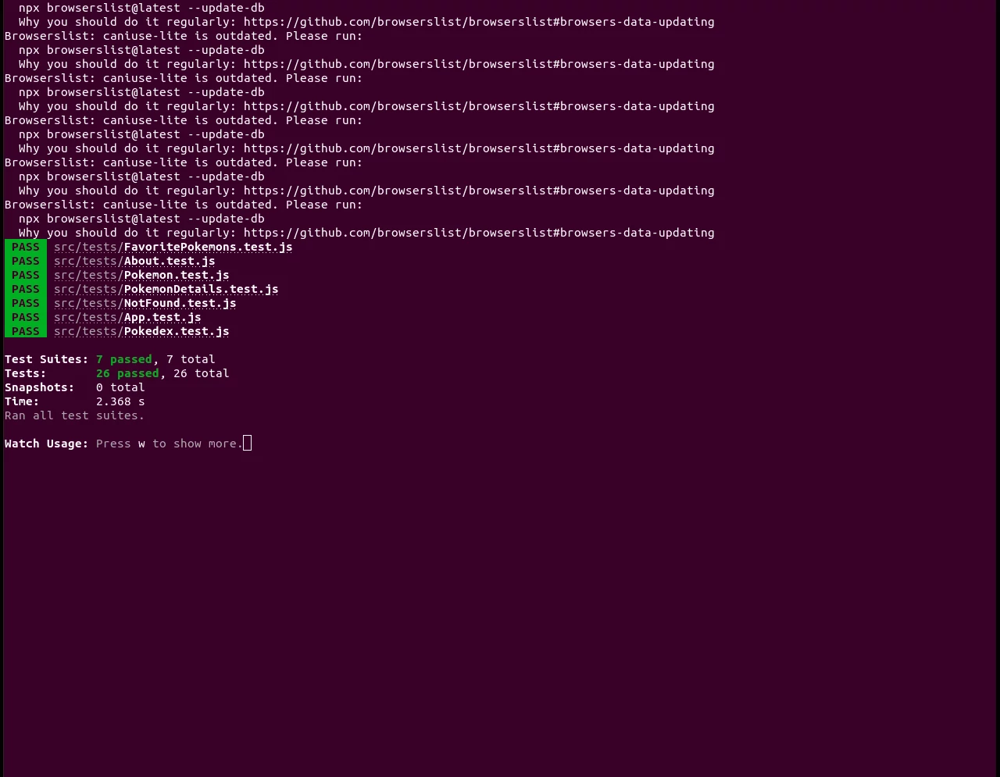
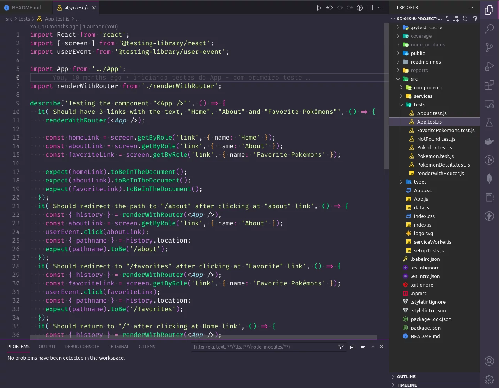

# Sobre

## Seção: `Testes automatizados com React Testing Library`

- Foi apresentado uma parte fundamental para desenvolvimento de software de qualidade, que são os testes, com foco na biblioteca do [react testing library](https://testing-library.com/). Monstrando boas práticas, uso de seletores, fluxo lógicos assíncronos.
#

  

>*clique na imagem para acesso online do projeto*
#
## Projeto: `React Testing Library`
- Foi aplicados todas técnicas apresentadas na seção, para criação de testes automatizados em um frontend ja desenvolvido pela trybe, garantindo que usando uma biblioteca de mutação, deveria ocorrer erros no teste, quando a aplicação se comportasse de forma errada.

# Tecnologias e ferramentas usadas 🛠

# Desafios

- lore

# Conclusão

- lore

  

    <strong>
      :newspaper_roll: Requisitos solicitados durante o desenvolvimento do projeto
    </strong>
  

 
### Requisitos
*Nome* | *Avaliação*
--- | :---:
1 - lore | :heavy_check_mark:

  

    <strong>
      :memo: Todo list
    </strong>
  

  - [x] - ~~Criar testes automatizados seguindo os requisitos da trybe.~~ 

#

  

